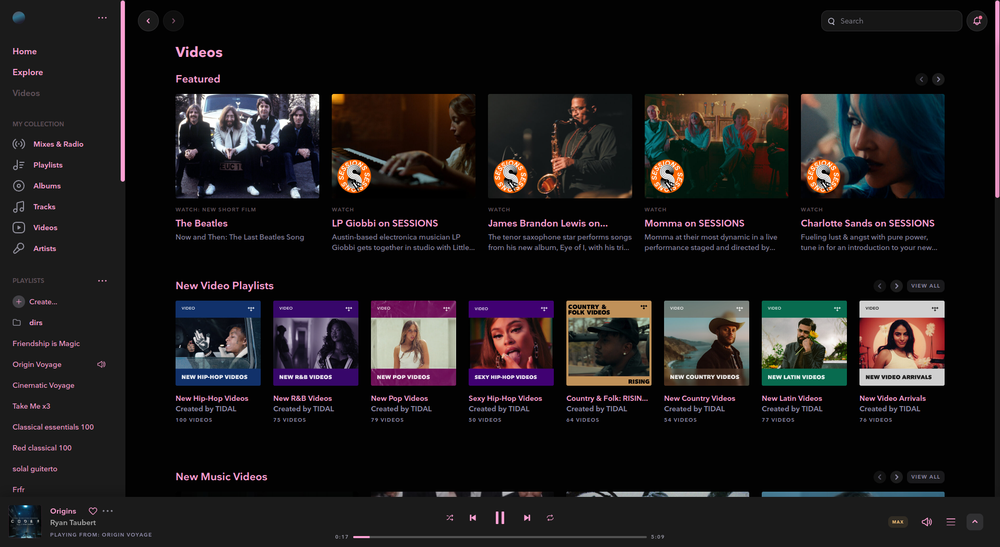

# Tidal-HiFi Theme

A custom theme for Tidal-HiFi on Linux that enhances the visual experience while maintaining functionality.

<p align="center">
  
  <br>
  <em>Screenshot showcasing the theme</em>
</p>

## Overview

This repository contains a custom CSS theme for the Tidal-HiFi application on Linux. The theme aims to provide a more visually appealing interface while ensuring all features remain accessible and functional.

## Features

- Custom styling for Tidal-HiFi application
- Improved visual aesthetics
- Maintained functionality of all Tidal features
- Linux-optimized design

## Installation

### Prerequisites

- Tidal-HiFi installed on your Linux system
- Access to Tidal-HiFi's resource files

### Setup Instructions

1. Clone this repository:
   ```bash
   git clone https://github.com/yourusername/tidal-hifi-theme.git
   ```

2. Copy the CSS file to your Tidal-HiFi application directory:
   ```bash
   cp tidal.vimkat.css /path/to/tidal/resources/themes/
   ```

3. Apply the theme by modifying Tidal's configuration to use the custom CSS file.

## Usage

After installation, restart the Tidal-HiFi application to see the theme applied. The theme will automatically be loaded when Tidal starts.

## Customization

You can customize the theme further by editing the `tidal.vimkat.css` file:

```bash
# Open with your preferred text editor
vim tidal.vimkat.css
```
